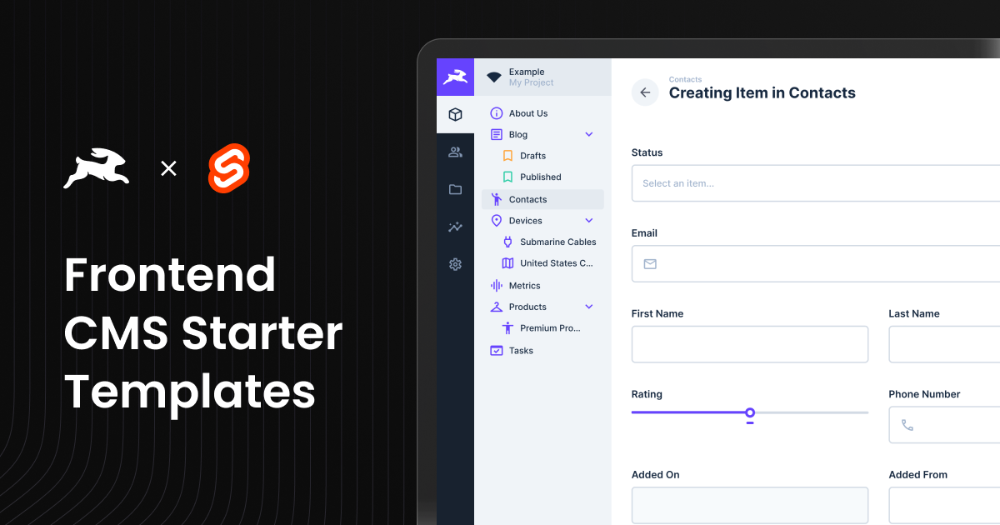

# SvelteKit CMS Template with Directus Integration

<div align="center">
  
</div>

This is a **Sveltekit-based CMS Template** that is fully integrated with [Directus](https://directus.io/), offering
a headless CMS solution for managing and delivering content seamlessly. The template leverages modern technologies like
**Tailwind CSS**, and **Shadcn components**, providing a complete and scalable starting
point for building CMS-powered web applications.

## **Features**

- **SvelteKit file based routing**: Uses SvelteKit file-based routing for layouts and dynamic routes.
- **Full Directus Integration**: Directus API integration for fetching and managing relational data.
- **Tailwind CSS**: Fully integrated for rapid UI styling.
- **TypeScript**: Ensures type safety and reliable code quality.
- **Shadcn Components**: Pre-built, customizable UI components for modern design systems.
- **ESLint & Prettier**: Enforces consistent code quality and formatting.
- **Dynamic Page Builder**: A page builder interface for creating and customizing CMS-driven pages.
- **Preview Mode**: Built-in draft/live preview for editing unpublished content.
- **Optimized Dependency Management**: Project is set up with **pnpm** for faster and more efficient package management.

---

## **Draft Mode in Directus and Live Preview**

### **Draft Mode Overview**

Directus allows you to work on unpublished content using **Draft Mode**. This Sveltekit template is configured to support
Directus Draft Mode out of the box, enabling live previews of unpublished or draft content as you make changes.

### **Live Preview Setup**

[Directus Live Preview](https://directus.io/docs/tutorials/getting-started/implementing-live-preview-in-sveltekit)

- The live preview feature works seamlessly on deployed environments.
- **For Local Development**: If using local Docker, the CSP configuration is provided in `.env.example`. See [`../../directus/README.md`](../../directus/README.md#content-security-policy-csp-and-preview-issues) for details.
- **For Directus Cloud**: Directus Cloud requires HTTPS for previews. You'll need to use HTTPS tunneling (ngrok, localtunnel, etc.) or configure CSP in your Directus Cloud settings. See the [Directus CSP documentation](../../directus/README.md#content-security-policy-csp-and-preview-issues) for details.

---

## **Getting Started**

### Prerequisites

To set up this template, ensure you have the following:

- **Node.js** (16.x or newer)
- **npm** or **pnpm**
- Access to a **Directus** instance ([cloud or self-hosted](../../README.md))

## Directus Setup Instructions

For instructions on setting up Directus, choose one of the following:

- [Setting up Directus Cloud](https://github.com/directus-labs/starters?tab=readme-ov-file#using-directus-with-a-cloud-instance-recommended)
- [Setting up Directus Self-Hosted](https://github.com/directus-labs/starters?tab=readme-ov-file#using-directus-locally)

## One-Click Deploy

You can instantly deploy this template using Vercel:

[](https://vercel.com/new/clone?repository-url=https://github.com/directus-labs/starters/tree/main/cms/sveltekit&env=PUBLIC_DIRECTUS_URL,PUBLIC_SITE_URL,DIRECTUS_SERVER_TOKEN,PUBLIC_ENABLE_VISUAL_EDITING)

---

> **This SvelteKit starter is pre-configured for Vercel.**
>
> To deploy on Netlify:
>
> 1. Run: `pnpm add -D @sveltejs/adapter-netlify`
> 2. In `svelte.config.js`, swap the adapter line:
>    ```js
>    import adapter from '@sveltejs/adapter-netlify';
>    // import adapter from '@sveltejs/adapter-vercel';
>    ```
> 3. Commit and redeploy manually.

---

### **Environment Variables**

To get started, you need to configure environment variables. Follow these steps:

1. **Copy the example environment file:**

   ```bash
   cp .env.example .env
   ```

2. **Update the following variables in your `.env` file:**
   - **`PUBLIC_DIRECTUS_URL`**: URL of your Directus instance.
   - **`PUBLIC_SITE_URL`**: The public URL of your site. This is used for SEO metadata and blog post routing.
   - **`DIRECTUS_SERVER_TOKEN`**: Token from the **Webmaster** account in Directus. Used server-side for preview, draft content, and form submissions.
   - **`DIRECTUS_ADMIN_TOKEN`**: Admin token for local type generation only. Never used at runtime.
   - **`PUBLIC_ENABLE_VISUAL_EDITING`**: Visual editing is enabled by default. Set to `false` to disable.

## **Running the Application**

### Local Development

1. Install dependencies:

   ```bash
   pnpm install
   ```

   _(You can also use `npm install` if you prefer.)_

   **Note for npm users:** This project uses pnpm workspaces. If you're using npm instead, you'll need to:

   ```bash
   rm -rf node_modules pnpm-lock.yaml
   npm install
   ```

   npm doesn't support pnpm's `workspace:` protocol, so you must remove `pnpm-lock.yaml` before running `npm install`. The project will generate a `package-lock.json` instead.

2. Start the development server:

   ```bash
   pnpm run dev
   ```

3. Visit [http://localhost:3000](http://localhost:3000).

## Generate Directus Types

This repository includes a [utility](https://www.npmjs.com/package/directus-sdk-typegen) to generate TypeScript types
for your Directus schema.

#### Usage

1. Ensure your `.env` file is configured as described above.
2. Run the following command:
   ```bash
   pnpm run generate:types
   ```
3. When prompted, enter your Directus admin token (with permissions to read system collections like `directus_fields`), or set it ahead of time via the `DIRECTUS_ADMIN_TOKEN` environment variable for non-interactive runs (e.g., CI).

> **Note:** The type generation requires an admin token with permissions to read system collections like `directus_fields`. You can either provide the admin token interactively when prompted, or set it via the `DIRECTUS_ADMIN_TOKEN` environment variable (e.g., `DIRECTUS_ADMIN_TOKEN=your_token pnpm run generate:types`) to run without a TTY.

## Folder Structure

```
src/
├── app.d.ts
├── app.html                                    # Main app.html
├── fonts.css
├── globals.css
├── lib
│   ├── components
│   │   ├── blocks                              # Block builder elements
│   │   │   ├── BaseBlock.svelte
│   │   │   ├── Button.svelte
│   │   │   ├── ButtonGroup.svelte
│   │   │   ├── Form.svelte
│   │   │   ├── Gallery.svelte
│   │   │   ├── Hero.svelte
│   │   │   ├── Posts.svelte
│   │   │   ├── Pricing.svelte
│   │   │   ├── PricingCard.svelte
│   │   │   └── RichText.svelte
│   │   ├── forms                               # Dynamic Forms
│   │   │   ├── DynamicForm.svelte
│   │   │   ├── FormBuilder.svelte
│   │   │   ├── FormField.svelte
│   │   │   └── fields
│   │   │       ├── CheckBoxGroupField.svelte
│   │   │       ├── FileUploadField.svelte
│   │   │       ├── RadioGroup.svelte
│   │   │       └── SelectField.svelte
│   │   ├── layout                              # General Layout
│   │   │   ├── Footer.svelte
│   │   │   ├── LightSwitch.svelte
│   │   │   ├── NavigationBar.svelte
│   │   │   └── PageBuilder.svelte
│   │   ├── shared
│   │   │   └── DirectusImage.svelte            # Image Component for all assets from Directus
│   │   └── ui                                  # ShadCn and custom components
│   │       ├── Container.svelte
│   │       ├── Form.svelte
│   │       ├── Headline.svelte
│   │       ├── SearchModal.svelte
│   │       ├── ShareDialog.svelte
│   │       ├── Tagline.svelte
│   │       ├── Text.svelte
│   │       ├── Title.svelte
│   │       ├── badge
│   │       │   ├── badge.svelte
│   │       │   └── index.ts
│   │       ├── button
│   │       │   ├── button.svelte
│   │       │   └── index.ts
│   │       ├── checkbox
│   │       │   ├── checkbox.svelte
│   │       │   └── index.ts
│   │       ├── collapsible
│   │       │   └── index.ts
│   │       ├── command
│   │       │   ├── command-dialog.svelte
│   │       │   ├── command-empty.svelte
│   │       │   ├── command-group.svelte
│   │       │   ├── command-input.svelte
│   │       │   ├── command-item.svelte
│   │       │   ├── command-link-item.svelte
│   │       │   ├── command-list.svelte
│   │       │   ├── command-separator.svelte
│   │       │   ├── command-shortcut.svelte
│   │       │   ├── command.svelte
│   │       │   └── index.ts
│   │       ├── dialog
│   │       │   ├── dialog-content.svelte
│   │       │   ├── dialog-description.svelte
│   │       │   ├── dialog-footer.svelte
│   │       │   ├── dialog-header.svelte
│   │       │   ├── dialog-overlay.svelte
│   │       │   ├── dialog-portal.svelte
│   │       │   ├── dialog-title.svelte
│   │       │   └── index.ts
│   │       ├── dropdown-menu
│   │       │   ├── dropdown-menu-checkbox-item.svelte
│   │       │   ├── dropdown-menu-content.svelte
│   │       │   ├── dropdown-menu-group-heading.svelte
│   │       │   ├── dropdown-menu-item.svelte
│   │       │   ├── dropdown-menu-label.svelte
│   │       │   ├── dropdown-menu-radio-group.svelte
│   │       │   ├── dropdown-menu-radio-item.svelte
│   │       │   ├── dropdown-menu-separator.svelte
│   │       │   ├── dropdown-menu-shortcut.svelte
│   │       │   ├── dropdown-menu-sub-content.svelte
│   │       │   ├── dropdown-menu-sub-trigger.svelte
│   │       │   └── index.ts
│   │       ├── form
│   │       │   ├── form-button.svelte
│   │       │   ├── form-description.svelte
│   │       │   ├── form-element-field.svelte
│   │       │   ├── form-field-errors.svelte
│   │       │   ├── form-field.svelte
│   │       │   ├── form-fieldset.svelte
│   │       │   ├── form-label.svelte
│   │       │   ├── form-legend.svelte
│   │       │   └── index.ts
│   │       ├── input
│   │       │   ├── index.ts
│   │       │   └── input.svelte
│   │       ├── label
│   │       │   ├── index.ts
│   │       │   └── label.svelte
│   │       ├── radio-group
│   │       │   ├── index.ts
│   │       │   ├── radio-group-item.svelte
│   │       │   └── radio-group.svelte
│   │       ├── select
│   │       │   ├── index.ts
│   │       │   ├── select-content.svelte
│   │       │   ├── select-group-heading.svelte
│   │       │   ├── select-item.svelte
│   │       │   ├── select-scroll-down-button.svelte
│   │       │   ├── select-scroll-up-button.svelte
│   │       │   ├── select-separator.svelte
│   │       │   └── select-trigger.svelte
│   │       ├── separator
│   │       │   ├── index.ts
│   │       │   └── separator.svelte
│   │       ├── textarea
│   │       │   ├── index.ts
│   │       │   └── textarea.svelte
│   │       └── tooltip
│   │           ├── index.ts
│   │           └── tooltip-content.svelte
│   ├── directus
│   │   ├── directus-utils.ts
│   │   ├── directus.ts
│   │   ├── fetchers.ts                             # All Directus API queries
│   │   ├── fetchRedirects.ts
│   │   ├── visualEditing.ts
│   │   └── generateDirectusTypes.ts
│   ├── types
│   │   └── directus-schema.ts
│   ├── utils.ts
│   └── zodSchemaBuilder.ts
└── routes
    ├── +layout.server.ts
    ├── +layout.svelte
    ├── [...permalink]                              # Dynamic page routes
    │   ├── +page.server.ts
    │   └── +page.svelte
    ├── api
    │   └── search
    │       └── +server.ts
    └── blog
        └── [slug]                                  # /blog route
            ├── +page.server.ts
            └── +page.svelte
```

---
